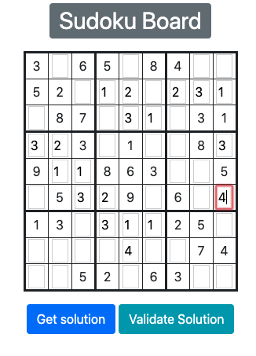
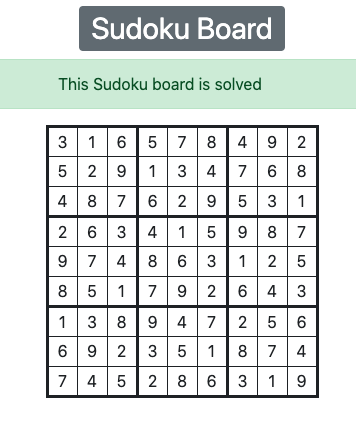

# Sudoku Game

    
    

## Build Guide:
+ Clone the repo
+ Run `pip install requirements.txt` to install dependencies of the project. Alternatively, you can also use `pipenv` to install.
+ Run `python3 app.py` to start the application.
+ Open the URL inside your terminal using a web browser. Usually the URL would be something like this: `http://127.0.0.1:5000/`
+ Enjoy !!

## Structure of the project:
+ `algorithms.py` contains the Backtracking algorithm used to find the solution for the board.
+ `app.py` contains the source code of the main Flask application.
+ `templates` folder contains the template in HTML and Jinja for Flask to control.

## Plan for improving user experience:
- [ ] Add graphical user interface for the application
- [ ] Let user choose the difficult level of the game
- [ ] Outputs random Sudoku board 
- [ ] Deploy to Heroku

## Plan to improve the project:
- [ ] Add the naive approach algorithm
- [ ] Examine and implement Stochastic search / optimization
- [ ] Compare the runtime between algorithms

## Dependencies:
+ [Flask](https://flask.palletsprojects.com/en/1.1.x/)
+ [Jinja](https://jinja.palletsprojects.com/en/2.11.x/)
